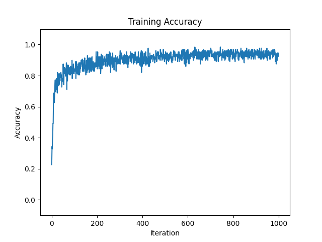
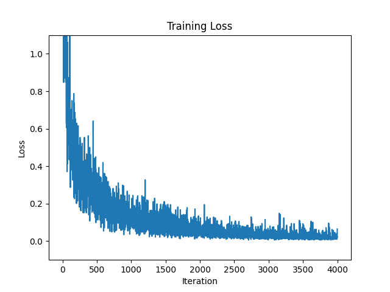
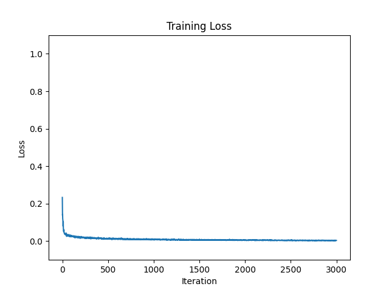

# np_nn

Simple implementation of feed forward and backward passes of a neural network with numpy and pytorch on MNIST dataset.

Inspired by https://github.com/geohot/ai-notebooks/blob/master/mnist_from_scratch.ipynb. 

If you are trying to understand what goes on "under the hood" in neural networks, please refer to `mlp_np.py`.

## Performances

### Pytorch

|Comparions| Test Accuracy |
|-----------|----------|
|[geohot](https://github.com/geohot/ai-notebooks/blob/master/mnist_from_scratch.ipynb)| 0.9288    | 
|**Ours**| 0.9617    | 

### Numpy

|Comparions| Test Accuracy |
|-----------|----------|
|[geohot](https://github.com/geohot/ai-notebooks/blob/master/mnist_from_scratch.ipynb)| 0.9635    | 
|**Ours**| 0.9783    | 

## Setup

1) Please download the appropriate miniconda3 for your OS at this [link](https://docs.conda.io/en/latest/miniconda.html). 
2) After downloading miniconda3, open your terminal or command prompt and execute the following command:
` conda `

If you see an output like the following:

`usage: conda [-h] [-V] command ...

conda is a tool for managing and deploying applications, environments and packages.`

you have successfully downloaded conda and can now set up your environment.

3)
