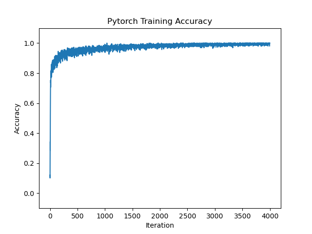
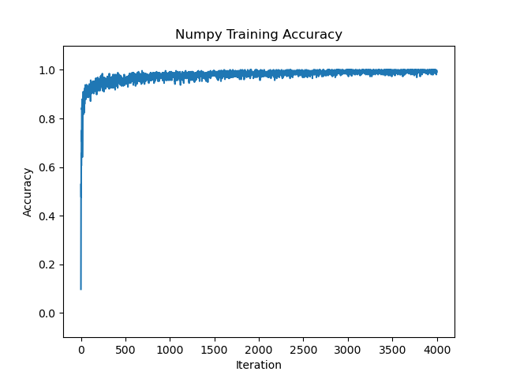

# np_nn

Simple implementation of feed forward and backward passes of a neural network with numpy and pytorch on MNIST dataset.

Inspired by https://github.com/geohot/ai-notebooks/blob/master/mnist_from_scratch.ipynb. 

## Setup

Please download the appropriate miniconda3 for your OS at this [link](https://docs.conda.io/en/latest/miniconda.html). 

After downloading miniconda3, open your terminal or command prompt and type/execute the following command:

`
conda
`

If you see an output like the following:

`
usage: conda [-h] [-V] command ...
`

`
conda is a tool for managing and deploying applications, environments and packages.
`

you have successfully downloaded conda and can now set up your environment.

Please type/execute the following command to create a virtual environment with a specific Python version:

`
conda create -n myenv python=3.8.16
`

Please type/execute the following command to activate your virtual environment:

`
conda activate myenv
`

Now that your virtual environment is activated, please clone this repository with the following command:

`
git clone https://github.com/willxxy/np_nn.git
`

If you do not have git downloaded, please download git for your respective OS at this [link](https://git-scm.com/)

Once you have cloned the repository, please change your directory to the repository by typing/executing the following command:

`
cd np_nn
`

Please type/execute the following command to download the necessary packages and their respective versions:

`
pip install -r requirements.txt
`

After installing the necessary requirements, you can now start training!

Execute the following command to train the numpy version of a neural network:

`
python main_np.py
`

Execute the following command to train the pytorch version of a neural network:

`
python main_torch.py
`

If you are trying to understand what goes on "under the hood" in neural networks, I recommend referring to the documentation in `mlp_np.py`.

## Performances

### Pytorch

|Comparions| Test Accuracy |
|-----------|----------|
|[geohot](https://github.com/geohot/ai-notebooks/blob/master/mnist_from_scratch.ipynb)| 0.9288    |  128 | 784| 128 | 1000 | 0.001 | 
|**Ours**| 0.9633    | 256 | 784| 512 | 4000 | 0.001 | 

### Numpy

|Comparions| Test Accuracy | Batch Size | Layer 1 Size | Layer 2 Size | Epochs | Learning Rate | 
|-----------|----------|----------|----------|----------|----------|----------|
|[geohot](https://github.com/geohot/ai-notebooks/blob/master/mnist_from_scratch.ipynb)| 0.9635    | 128 | 784| 128 | 1000 | 0.001 | 
|**Ours**| 0.9805    | 256 | 784| 512 | 4000 | 0.001 | 

