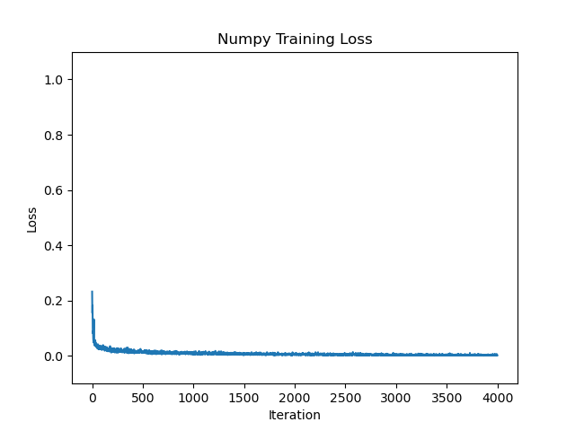

# np_nn

Simple implementation of feed forward and backward passes of a neural network with numpy and pytorch on MNIST dataset.

Inspired by https://github.com/geohot/ai-notebooks/blob/master/mnist_from_scratch.ipynb. 

### News
- Dec. 9. 2023 ~ Added ResNet!

## Brief Introduction to Machine Learning

Before setting up your computer to run your first neural network, I wanted to give a brief introduction to machine learning. 
Ever since I joined the [AI Club at UCI](https://aiclub.ics.uci.edu/) back in September 2021, I have been 
furiously studying machine learning. Machine learning is something that is quite magical, and the last 50 to 70 years of research in numerous fields, including but not limited to statistics, psychology, linguisitics, and of course, artificial intelligence, has paved a bright path for people like myself to build upon.

So with that, I want to start this attempt to introduce machine learning with a definition coined by [Dr. Peter Chang](https://www.faculty.uci.edu/profile.cfm?faculty_id=6569), 
a radiologist by training and Co-Director of the [Center for Artificial Intelligence in Diagnostic Medicine](https://www.caidm.som.uci.edu/). He defines machine learning
algorithms as something that maps inputs to desired outputs through a model whose parameters may be trained through iterative exposure to data [1]. 

  

Let's break this down. First, what is an algorithm? The Oxford dictionary defines it as 'a process or set of rules to be followed in calculations or other problem-solving operations, especially by a computer.' So, in our case, the process or set of rules to be followed is to map inputs to desired outputs. The calculations or problem-solving operations would be performed in the model, and the parameters would be the variables that need to be computed while interacting with the inputs and outputs. These parameters than need to be exposed to an arbitrary set of data in a repetitive manner for it to 'train.' To further explain what the word 'trained' means in the definition, I believe a real-world example would be best.

Let's say you want to have muscles like the person shown below:

  

The input would be one's body and the output would be muscles. The process or set of rules to be followed can be a strict diet or workout routine. Introducing your body to a strict diet and workout routine can be the mapping between the input and output. The model can be represented as the chosen diet or workout and the parameters would be the specific ingredients to the diet or workout, such as vegetables, meat, calisthenics, hard weights, etc. The training begins when you repeatedly engage your input (body) to the model (workout/diet), while continuously updating the parameters (best diet, best workout). In this example, the data would be somewhat synonymous with the parameters, but it can be set apart as the knowledge and experimentation of which diet or workout produces the desired output. If protein and pull ups seems to be producing the most muscle, one would want to constantly use and feed this data or knowledge into the model. If your model is trained successfully over a period of time, theoretically, you would have outputted some muscles. However, life and machine learning algorithms do not work this way and there are many confounding variables that you find along the process of training a successful model. For the sake of simplicity, I will not go into such adversarial components.

Hopefully, you now have a somewhat intuitive idea of what a machine learning algorithm is, and now I will propose three different categories of such algorithms. I would agree with Dr. Chang in that there are three different kinds of machine learning algorithms [1]: 1) Traditional Statistics; 2) Traditional Machine Learning; 3) Neural Networks. 

An example of a traditional statistical machine learning algorithm can be something like `y = mx + b`. 
As we all learned in middle school, `x`, `y` denotes the input and output, and `m`, `b` represents the variable parameters (slope and intercept).
Traditional statistics is extremely good at finding linear relationships between variables but when data becomes more obscure and abstract, traditional machine learning algorithms tend to outperform in determining correlations. 

To battle complex inputs and non-linearity, traditional machine learning algorithms try to refine complex data (e.g. image) into numbers represented as a vector.
This distillation is called feature extraction and machine learning algorithms can capture rich traits of the data, such as spatial context, multi-resolution, locality, and globality. 

   
  <em>The MNIST dataset. We will be using this dataset!</em>

It is important to note that these features do not need to be complex. However, in practice, data is multidimensional, therefore 
a huge amount of research has gone into transforming N-dimensional feature vector projections to something computers can understand. 
Given these feature vectors, the most common function machine learning algorithms face is classification, which can be described as making predictions with existing data. 
I will not go over any specific traditional machine learning algorithms, but here is a list of them for you to explore: 
- [Support Vector Machine](https://en.wikipedia.org/wiki/Support-vector_machine)
- [k-Nearest Neighbor](https://en.wikipedia.org/wiki/K-nearest_neighbors_algorithm)
- [XGBoost](https://xgboost.readthedocs.io/en/stable/)
- [Random Forest](https://en.wikipedia.org/wiki/Random_forest#:~:text=Random%20forests%20or%20random%20decision,class%20selected%20by%20most%20trees.)

Now, what if there are no apparent features or parameters within a dataset? This is where neural networks shine. 

   
  <em>A picture of a neural network. Each circle in the image above is represented as a node, and there are three main layers that comprises a neural network: the input layer, hidden layer(s), and output layer. Each node is linked to another and has an assigned weight and threshold. If the output of any individual node is above a specified threshold value, the node is activated and sends the data to the next layer of the network [2]. Otherwise, no data is passed. A neural network with n > 1 hidden layers is categorized as a deep neural network.</em>

Neural networks have a rich history that dates back to the work of McCulloch and Pitts in the 1940s [3]. Inspired by the intricate workings of the human brain, neural networks are composed of interconnected nodes called neurons, organized in layers that process and transmit information. Each neuron receives inputs, applies mathematical transformations (e.g. matrix multiplications), and passes the outputs to the next layer, enabling the network to learn intricate relationships within the data.

At the heart of neural networks lies the concept of a weighted sum. Inputs are multiplied by corresponding weights, and the resulting products are summed together. This sum is then transformed by an activation function, introducing non-linearity to model complex relationships (4). Popular activation functions include the [sigmoid](https://mathworld.wolfram.com/SigmoidFunction.html), [hyperbolic tangent (tanh)](https://reference.wolfram.com/language/ref/Tanh.html), and [rectified linear unit (ReLU)](https://machinelearningmastery.com/rectified-linear-activation-function-for-deep-learning-neural-networks/).

Training a neural network involves the iterative optimization algorithm called backpropagation. By calculating gradients (aka derivatives, aka calculus) of the network's parameters (weights and biases) with respect to a loss function, backpropagation guides the network towards minimizing the loss and improving prediction performance [5]. Coupled with optimization techniques like stochastic gradient descent, neural networks adapt and enhance their predictions over time.

Lastly, the historical narrative of neural networks highlights breakthroughs that have shaped their current prominence (e.g., ChatGPT, autonomous vehicles, face recognition etc.). From early perceptron models [6] to the advent of backpropagation by Rumelhard et al. (1986) [5], each advancement has contributed to the sophistication of neural networks. Furthermore, the rise of convolutional neural networks [7] and recent developments in deep learning architectures (e.g. transformers, which made ChatGPT) have propelled the field to unprecedented achievements in computer vision, natural language processing, and beyond.

  

I hope you enjoyed my very brief introduction to machine learning. If you are curious to learn more about this fascinating topic, below is a list of resources I previously used: 
- [Machine Learning Course by Andrew Ng](https://www.coursera.org/learn/machine-learning)
- [Machine Learning Course by freeCodeCamp](https://www.youtube.com/watch?v=NWONeJKn6kc&t=50s)
- [Machine Learning Course by Geoffrey Hinton](https://youtube.com/playlist?list=PLoRl3Ht4JOcdU872GhiYWf6jwrk_SNhz9)
- [MNIST classifier with NumPy from scratch by George Hotz](https://www.youtube.com/watch?v=JRlyw6LO5qo&t=8s)
- [Introduction to Neural Networks by Victor Zhou](https://victorzhou.com/blog/intro-to-neural-networks/)

**References**

[1] [Machine Learning Definition](https://uci.yuja.com/V/MediaFile?mediaFile=420457&node=15536234&a=1231719205&autoplay=1)

[2] [Neural Networks](https://www.ibm.com/cloud/learn/neural-networks)

[3] McCulloch, W. S., & Pitts, W. (1943). A logical calculus of the ideas immanent in nervous activity. The bulletin of mathematical biophysics, 5(4), 115-133.

[4] Goodfellow, I., Bengio, Y., & Courville, A. (2016). Deep Learning. MIT Press.

[5] Rumelhart, D. E., Hinton, G. E., & Williams, R. J. (1986). Learning representations by back-propagating errors. Nature, 323(6088), 533-536.

[6] Rosenblatt, F. (1958). The perceptron: A probabilistic model for information storage and organization in the brain. Psychological Review, 65(6), 386-408.

[7] LeCun, Y., Bengio, Y., & Hinton, G. (2015). Deep learning. Nature, 521(7553), 436-444.

## Setup

Please download the appropriate miniconda3 for your OS at this [link](https://docs.conda.io/en/latest/miniconda.html). 

After downloading miniconda3, open your terminal or command prompt and type/execute the following command:

`
conda
`

If you see an output like the following:

`
usage: conda [-h] [-V] command ...
`

`
conda is a tool for managing and deploying applications, environments and packages.
`

you have successfully downloaded conda and can now set up your environment.

Please type/execute the following command to create a virtual environment with a specific Python version:

`
conda create -n myenv python=3.8.16
`

Please type/execute the following command to activate your virtual environment:

`
conda activate myenv
`

Now that your virtual environment is activated, please clone this repository with the following command:

`
git clone https://github.com/willxxy/np_nn.git
`

If you do not have git downloaded, please download git for your respective OS at this [link](https://git-scm.com/)

Once you have cloned the repository, please change your directory to the repository by typing/executing the following command:

`
cd np_nn
`

Please type/execute the following command to download the necessary packages and their respective versions:

`
pip install -r requirements.txt
`

After installing the necessary requirements, you can now start training!

Execute the following command to train the numpy version of a neural network:

`
python main_np.py
`

Execute the following command to train the pytorch version of a neural network:

`
python main_torch.py
`

If you desire to understand what goes on "under the hood" in neural networks, I recommend referring to the documentation in `mlp_np.py`.

## Performances

Please note that the performance may be slightly different. 

If there are discrepancies (anything greater than +-0.01) between your test accuracy and ours, please reach out by submitting an issue or email wjhan{at}andrew{dot}cmu{dot}edu.

### Pytorch

|Comparions| Test Accuracy |Batch Size | Layer 1 Size | Layer 2 Size | Epochs | Learning Rate | 
|-----------|----------|----------|----------|----------|----------|----------|
|[geohot](https://github.com/geohot/ai-notebooks/blob/master/mnist_from_scratch.ipynb)| 0.9288    |  128 | 784| 128 | 1000 | 0.001 | 
|**Ours**| 0.9633    | 256 | 784| 512 | 4000 | 0.001 | 

### Numpy

|Comparions| Test Accuracy | Batch Size | Layer 1 Size | Layer 2 Size | Epochs | Learning Rate | 
|-----------|----------|----------|----------|----------|----------|----------|
|[geohot](https://github.com/geohot/ai-notebooks/blob/master/mnist_from_scratch.ipynb)| 0.9635    | 128 | 784| 128 | 1000 | 0.001 | 
|**Ours**| 0.9805    | 256 | 784| 512 | 4000 | 0.001 | 

## Short term TODOs
- [] Create visualizations for forward and backward passes.

## Long term TODOs
- [] Implement more models.
